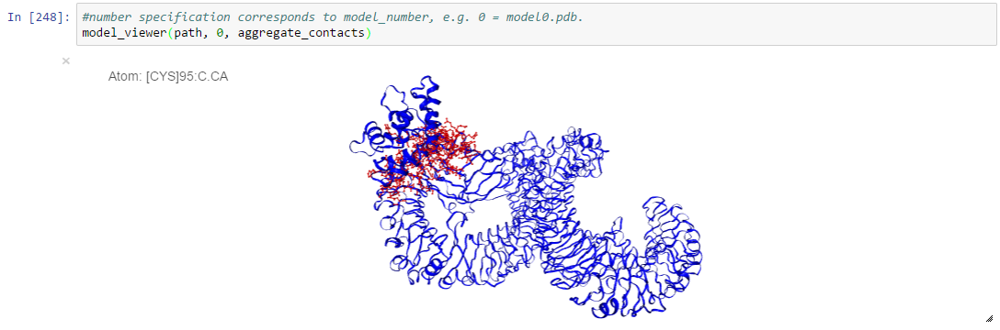
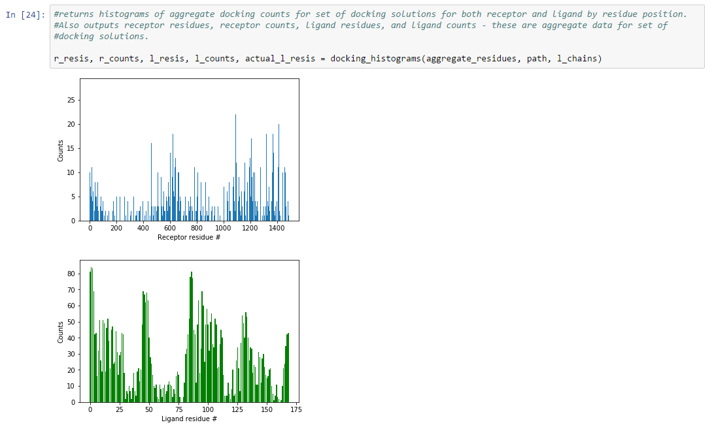
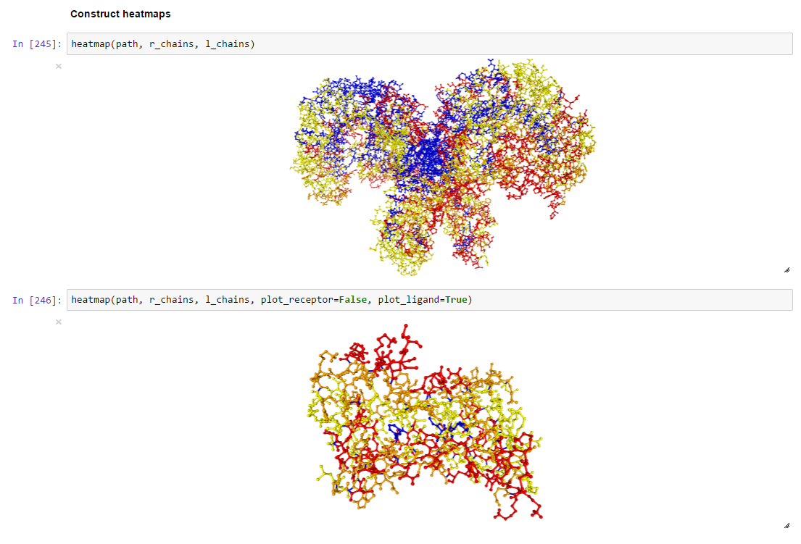

# Protein-protein interaction docking analysis package

This package utilizes tools from [MDtraj](http://mdtraj.org/latest/index.html) and [nglview](http://arose.github.io/nglview/latest/index.html) to streamline analysis and visualization of protein-protein interaction docking solutions from servers such as ClusPro, Rosetta, Haddock, Swarmdock, Pie-Dock, etc. 

Docking solution files are first converted to an MDtraj-friendly format using ***mdtraj_converter*** (this package currently only contains code for ClusPro conversion, but can be easily adapted to other file types). A new directory is created within your working directory entitled  "converted_models/" where your MDtraj-friendly files get dumped. 

MDtraj is then used to calculate interface residues between two docked structures using ***get_interface_contacts*** and ***contacts_iterator***. A distance cutoff is set between all ligand and receptor alpha carbons, with 10 angstroms as default. ***contacts_iterator*** is designed to analyze all docking solution files in your working directory. Outputs are aggregate_contacts (all ligand-receptor atom contacts) and aggregate_residues (all ligand-receptor residue contacts), which get saved as callable pickle files in a new folder entitled  "summary_data/" in your working directory.

nglview can be used to visually represent individual docking solutions via ***model_viewer:***

Histograms of aggregate docking solution hits by residue, from N- to C-terminus, are also provided via ***docking_histograms:***

Finally, aggregate docking solutions are mapped onto receptor and ligand structures via ***atom_contacts_parser*** and ***heatmap:*** The heatmap is currently low resolution, separating residues by counts into 0 counts (blue), low counts (yellow), medium counts (orange), and high counts (red), but can easily be tailored to identify particular hotspots of interest.

# Next steps:
- expand conversion capabilities to other server results
- craft a more useful class/OOP architecture for this software (current working class is one giant class of all functions defined in notebook version)
- expand upon residue analysis tools:
  - more refined heatmap resolution
  - analysis of residue types, more residue metadata
